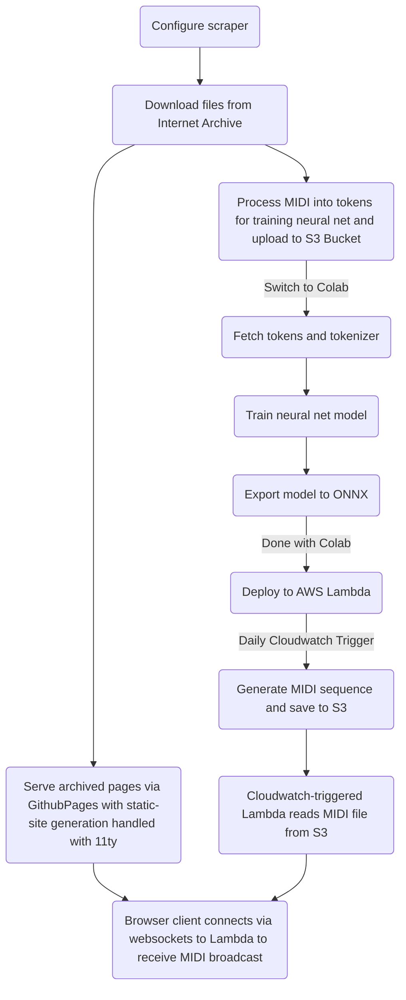

# MIDI-Archive Lambda
This repo is responsible for defining multiple AWS Lambda functions, which are used for generating MIDI files from a inference model (ML) trained on an training set defined at https://github.com/reubenson/midi-archive.

The model is a simple transformer model, built on the PyTorch library, and based on Andrej Karpathy's Neural Net lecture series.

## Workflow diagram

### Training Notebook
[Add source code and link to colab notebook]

### Lambda #1
The handler and deployment script is defined at `/neural-net`

### Lambda #2
The handler and deployment script is defined at `/midi-save`

## Workflow Notes
[This workflow is also visually described in the Architecture Diagram above]
- `MIDI Archive` repo is responsible for furnishing the training set in the form of .midi files and tokenized .json files
- In this repo, run the notebook to generate tokenizer config and tokenized dataset
- Assuming lack of access to local compute resources, run training on Colab, using pre-tokenized dataset
- After training, export the trained model to ONNX
- use the deploy script in `/midi-save` to push the model up an AWS Lambda Layer
- update the layer version in the Lambda function
- updated model is now deployed!

<!-- The Lambda will send periodic websockets messages to client browsers containing a payload of MIDI data generated by the neural net model. -->

## Installation
<!-- Follow instrictions at https://github.com/nficano/python-lambda, which is the repo this project follows. Unfortunately, its releases are lagging, and an [important update](https://github.com/nficano/python-lambda/pull/714) has not made its way into the official package distribution. Until then, I'm running a local version of the repo: `pip install -e ../python-lambda`, in order for `lambda deploy` to work as expected -->

## Commands
<!-- Zip up and deploy lambda with `lambda deploy --requirements ./requirements.txt`. The requirements flag is useful because I've been having weird issues with the installer pulling in all kinds of things from venv -->

## Misc notes
<!-- - To get the Lambda working properly, I had to fuss with permissions a bunch [here](https://us-east-1.console.aws.amazon.com/iam/home?region=us-east-1#/roles/details/lambda_basic_execution?section=permissions) -->
- Used `docker run --rm -v $(pwd):/package highpoints/aws-lambda-layer-zip-builder miditok` to generate .zip with miditok dependency (https://github.com/HighPoint/aws-lambda-onnx-model)

## Requirements
<!-- - User should be able to plug in a MIDI instrument and have it controlled by messages from Lambda?? -->